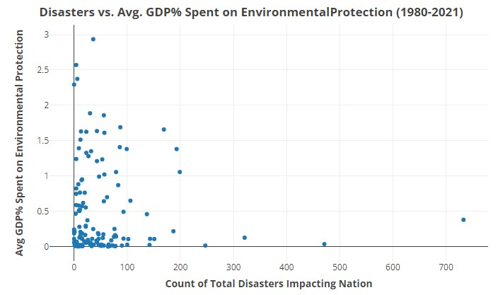

# The Impacts of Climate Change on Human Health

### Code Name - ClimateChange1

#### Authors:
Calvin Standaert - calvinst@uw.edu, Ian Paul - ianpaul@uw.edu, Zahra Firoz- zahraf@uw.edu, Thu La- tkl22@uw.edu

#### Affiliation:
INFO-201: Technical Foundations of Informatics - The Information School - University of Washington
#### Date
Autumn 2022
## Abstract
The effects of climate change on the natural environment are widely investigated, yet the impacts of climate change on human health are lesser known. As the impacts of climate change continue to proliferate around the world, it is more important than ever to identify the ways that climate change impacts human health. Overall, the main question we seek to answer is _“how does climate change impact human health?”_.

#### Keywords:
Climate Change, Human Health, Natural Disasters, Human Activity  
## Introduction
Climate change is by most accounts one of the most important issues facing humanity today. Due to its importance, a significant amount of scientific research has been done on the observed and predicted effects of climate change on sea-level rise, habitat loss, temperature rise, and other aspects of the natural environment. Coinciding with the scientific interest in climate change, climate change is also an issue of key importance to governments and peoples of the world who will be impacted by its effects. Despite the wealth of research on climate change and its importance to human societies, the specific effects of climate change on human health are not particularly well-known. As a result of this lack of information on the matter, we seek to conduct an analysis of the available data in order to better understand the impacts of climate change on human health.  

## Problem Domain

### Direct and Indirect Stakeholders:
The article from Cabral et al (2019) discusses how the increasing sea temperatures from climate change is one of the important factors in biodiversity loss. The text states, “The magnitude of human impacts has been higher in coastal zones compared to offshore areas, with climate change, fishing, and pollution being the most significant pressures”. The article does a good job of noting the consequences of human activities on coastal areas from overfishing to man-made pollution and their expected outcomes. This causes issues of suffocation, organisms being unable to reproduce, harmful algae blooms, and animal habitats being destroyed. Direct stakeholders of climate change's impact on coastal zones are fishermen, water-based organisms, and coastal-based communities. This important topic raises questions on human values, for instance, Is money more valuable than entire ecosystems and species? What is the real cost of human activities in today's world?  

Haines et al (2004) explained that the increase in temperatures means an increase in the occurrence of contracting diseases, noting that the spread of malaria can increase in areas with warmer climates. According to Padhy Et Al (2015), fluctuating climate increases the possibility of droughts and floods, which results in economic hardships for farmers, and can then lead to suicide. An increase in temperature also leads to agricultural and life-sustaining issues such as wildfires and droughts. Notable indirect stakeholders of climate change's increasing temperatures are humans contracting the disease at a higher rate, Agricultural societies and farmers who face loss of crops due to drought and wildfire, and lastly animals who lose habitat and resources because of these conditions.   

### Human Values:

Climate change affects many aspects of human civilization and life including the structure and flow of economies, land management, and food production. Climate change also has a significant impact on the natural environment including the health of habitats, the distribution of species, and ecosystem functions. Notable topics within the larger climate change phenomenon include increased natural disasters, air pollution, degradation of the environment, and mental health issues. Understanding the effects of climate change the values we chose to prioritize in this project are thus human health and care for the environment.  

### Potential Benefits and Harms:

The results produced through our research can be of beneficial use to the public by offering additional information on the effects of climate change while also possibly resolving misconceptions. On the other hand, the consequences of our research include misusing data to exaggerate negative financial effects, greenwashing that could create problems in unimportant areas, and using our research as justification for conflict over resources.

## Research Questions:
#### **1. How has human health been impacted as a result of the environmental shifts caused by climate change?**

Answering how human health has been impacted as a result of climate change is the overall goal of our research. Understanding how human health is impacted as a result of climate change is important as it enables us to get a more encompassing view of climate change, and thus a better overall understanding of what human societies may face in the future. Motivating research for this question is the ongoing escalation of human-caused climate change and growing public fears over a future dominated by climate change effects.

#### **2. Which groups are most affected by the health risks posed by climate change?**

With many issues impacting human societies, how effects are distributed is not equal and some groups are often more affected than others. We suspect that climate change-related health impacts likely have an unequal distribution of effects across different groups, and so we hope to determine which groups are most affected. Knowing which groups are most affected is important as it enables governments and communities to support threatened populations and plan for circumstances where they may require aid.

#### **3. How have the governments of those most affected by climate change health risks responded?**

After understanding how climate change is impacting human health and which groups are most affected by those impacts, we seek to determine how the governments of the most affected groups are reacting to their citizen’s vulnerability/harm. Knowing how a government of the most vulnerable groups is responding to climate change is particularly important as such information can be used to influence political decision-making and/or be used as evidence of governmental neglect.

## The Dataset:
| File Name                                                           | Observation Count | Variable Count |
|---------------------------------------------------------------------|-------------------|----------------|
| 2021_Cities_Climate_Change_Impacts_on_Health_and_Health_Systems.csv &nbsp;| 1217              | 17             |
| 2022_Cities_Climate_Hazards.csv                                     | 3910              | 26             |
| Climate-related_Disasters_Frequency.csv                             | 968               | 52             |
| Environmental_Protection_Expenditures.csv                           | 1523              | 36             |

#### **Data Relation to Problem Domain and Research Questions:**

Our dataset is composed of data on the human health impacts of climate, climate-related disaster frequency, city climate hazards, and data on governmental expenditures on environmental protection and climate change action. This data is directly related to our problem domain of climate change and human health and will allow us to answer each of our three research questions. Specifically, the data we gathered on the reported effects of climate change on human health, the main climate hazards present in major cities, and our data on the frequency of climate-related disasters will enable us to answer our first research question which is concerned with what the main effects of climate change on human health are. In this case, we will use the frequencies of this data to compute the dominant effects. Next, by comparing the frequency and location of climate hazards, climate-related disasters, climate-related health impacts, and governmental expenditures on environmental protection we will be able to answer our second question on which groups are most affected by climate change health issues by finding the groups most represented across the different data files. Finally, after finding the groups most affected by climate change-related health issues, we will be able to compare the groups with governmental expenditures to determine how the governments of those most affected by climate change have responded to their citizens’ growing health issues.

#### **Data Provenance:**
Our data was mainly collected by two groups: the International Monetary Fund (IMF) and the Carbon Disclosure Project (CDP) with help from the ICLEI – Local Governments for Sustainability. The data on climate-related health issues and climate-related health hazards were gathered by the CDP/ICLEI through voluntary response questionnaires sent to cities. The data on climate-related health issues was gathered in 2021, while the data on climate-related health hazards were gathered in 2022. For the CDP/ICLEI, the purpose of gathering such data is to track progress on climate change initiatives, provide a dataset for tracking capital opportunities, and allow cities to gather their own data to aid local decision-making.

The data we gathered on climate-related disaster frequency and governmental environmental protection expenditure history was gathered by the International Monetary Fund as part of their climate change indicators project. The data on climate change-related disasters was gathered through The Emergency Events Database (EM-DAT) and the Centre for Research on the Epidemiology of Disasters (CRED) at Université Catholique de Louvain (UCLouvain) in Belgium. The data on governmental environmental protection expenditures was gathered by the IMF’s statistics department. The purpose of gathering the data in both cases is to provide a link between climate change considerations and global economics.

Across all of our data, the groups most likely to benefit from the data are investors who can use the data to inform on future investment opportunities. With that being said, the data is also useful for cities and larger governmental organizations to make policy decisions in relation to climate health concerns.

Both the CDP and the IMF are well-known, reputable organizations that appear to be very trustworthy. We obtained the data directly from the CDP and IMF websites, where the data is openly available for download.

#### **Data Sources:**
The first dataset we collected was tabular health questionnaire response data from the CDP in partnership with the ICLEI and is available on the CDP's website [here](https://data.cdp.net/Climate-Hazards/2021-Cities-Climate-Change-Impacts-on-Health-and-H/ixst-39vn).

The second dataset we collected was tabular hazard questionnaire response data from the CDP in partnership with the ICLEI and is found on the CDP's website [here](https://data.cdp.net/Climate-Hazards/2022-Cities-Climate-Hazards/rdq4-d52n).

Our third dataset was gathered from the The Emergency Events Database (EM-DAT) and Centre for Research on the Epidemiology of Disasters (CRED) / Université Catholique de Louvain (UCLouvain). The dataset is tabular data that counts the frequency of various climate-related disasters and is available from the IMF at [this page](https://climatedata.imf.org/datasets/b13b69ee0dde43a99c811f592af4e821_0/about).

Our final dataset is from the IMF Statistics department and records the environmental protection expenditures of various nations. This dataset is available from the IMF's website on [this page](https://climatedata.imf.org/datasets/d22a6decd9b147fd9040f793082b219b_0/about).

## Expected Limitations:
One of the most important outcomes that we hope to achieve from this project is to gain traction and spread information through hard facts about the need for immediate action with regard to climate change. A few of the envisioning cards that stood out to us while doing this research were 1; think of children, think of your future child or any kid, and what kind of planet you want them to grow up on. 2; Generational ripple, if we are selfish, who are we to teach the next generation not to be?  

Technologists and designers alongside climate change activists need to work together to produce while slowing down carbon emissions and greenhouse gasses, things like hybrid cars and greener energy are the future! Furthermore, policymakers should take this data into consideration when making decisions and laws regarding the future of their countries. What do we want to allow and what is a reasonable exchange, this is in regard to issues such as climate tax and banning the use of fuel-based cars.

## Limitations:
The most pressing limitations we will likely encounter in our work and need to address are limitations with how accurate our conclusions can be due to the nature of some of the data and limitations with how much we can extrapolate our findings to reality. With the first limitation, we expect to make reasonably strong conclusions from our data analysis, but there is a major issue of whether or not the data we make that analysis on is complete. We suspect the data might be incomplete and not fully represent reality due to the hard-to-record nature of climate change health impacts, along with the relative imprecision of the data on the group effects of climate change health impacts. Thus, when we finally do our analysis, there is a chance that we will unable to fully capture which effects of climate change on health are predominant, and which groups are most affected by climate-related health issues.

A final limitation we believe we will possibly encounter is a limitation on the breadth/depth of our analysis due to limits on how much time we can dedicate to the project. Limitations based on allotment of time are a common occurrence in many projects and, with our project specifically, we believe that limits on how much time we can allot to the project may affect the depth and breadth of our analyses.

## Findings:
After concluding research on our assembled dataset, we were able to answer each of our research questions.  
 

#### **Main Climate Health Impacts:**
| Health Impact Variable:       | Most Frequent Impacts:                                                                         |
|-------------------------------|------------------------------------------------------------------------------------------------|
| Climate-related Health Issues &nbsp;| Heat-related illnesses, air-pollution-related illnesses, and vector-borne infectious diseases. |
| Climate-related Hazards       | Extreme heat, heavy precipitation, and urban flooding.                                         |
| Climate-related Disasters     | Floods and storms.                                                                             |     
 

Starting with our first research question on the effects of climate change on human health, we determined that _climate change impacts human health by exacerbating or leading to a rise in certain health issues, health hazards, and climate disasters_. The most significant of our findings on this matter are shown in the table above. Looking at health issues, through our analysis of data on the reported effects of climate change on human health in city populations, we determined that the most frequent health issues related to climate change in 2021 were heat-related illnesses, air-pollution-related illnesses, and vector-borne infectious diseases. Next, by examining data on the reported effects of climate change on health hazards in city populations, we found that the climate-related health hazards that occurred most often in 2022 were extreme heat, heavy precipitation, and urban flooding. Finally, in our analysis of climate-disaster frequency, we identified that from 1980 to 2021, the most frequent climate-related disasters were floods and storms.
 

#### **Climate Health Impact Most Affected Groups:**
| Health Impact Variable:       | Most Affected Group:                                                          |
|-------------------------------|-------------------------------------------------------------------------------|
| Climate-related Health Issues &nbsp;| The elderly, children/youth, and low-income households.                       |
| Climate-related Hazards       | Low-income households, the elderly, and marginalized or minority communities. |
| Climate-related Disasters     | The United States, China, and India. 
 

Concerning our second research question on which groups are most affected by the health impacts of climate change, we found that _there are several population subgroups and several nations that are most affected by climate change health issues, health hazards, and disasters_. The groups we found to be most affected are detailed in the above table. Through our analysis of climate-related health impacts in cities, we determined that the population subgroups in 2021 most affected by climate-related health issues were the elderly, children/youth, and low-income households. Next by examining our data on climate-related health hazards in cities, we found that the population subgroups most impacted by climate-related health hazards in 2022 were low-income households, the elderly, and marginalized or minority communities. Lastly, by investigating our data on climate-related disaster frequency, we identified that the nations most impacted by climate-related disasters from 1980 to 2021 were The United States, China, and India.
 

#### **Governmental Response of Most-Affected Groups:**

 

Looking at our third and final research question on how the governments of those most affected by climate change have responded, we found that _there does not appear to be a clear connection between the number of climate-related disasters that a nation experienced and the percentage of a nation’s GDP that was spent on environmental protection_. We arrived at this conclusion after creating a scatterplot (shown above) that compared the total number of climate-related disasters that a nation experienced with the average percentage of a nation's GDP spent on environmental protection. What we ultimately found was that the resulting data did not follow any kind of clear pattern. Correlation analysis further revealed that the percent of a GDP spent by a nation and the number of climate-related disasters it experienced were very weakly negatively related (r = -.058). 

## Discussion:
After concluding our analysis of the effects of climate change on human health, we believe that our research shows that there are issues posed by climate change on human health that require immediate attention. 

Starting first with our findings on what the effects of climate change are, we believe that our identification of some of the key health impacts of climate change is critically important as it shows that climate change impacts on human health exist and these impacts are to damaging human health. By affirming that climate change impacts exist and these impacts damage human health, our research findings provide information that may help to resolve climate change-related misinformation and inform political decisions. Additionally, we believe that showing that climate change is impacting human health in the three key ways of our analysis may also be important as it may suggest that there are more, possibly unknown ways climate change affects human health.

Next, we also believe that our finding that certain population subgroups and certain nations are more affected by climate change-related health impacts than others is of high importance. 
Part of the reason why this finding is important is that it comes amidst a time when there is an established concern in many societies about the unfair treatment of certain population groups. Thus, by showing that some groups are more affected than others by climate change health effects, our findings could provide evidence of inequality within societies and across groups of nations. Besides unequal treatment, this finding is also important as knowledge of which groups are most affected by climate change can be used by societies to inform nations on which groups may need additional aid and which groups will need more protection as climate change progresses in the future. 

Lastly, our analysis of our final research question about how governments of those most affected by climate change have responded is important as we were not able to show a connection between the effects of climate change on nations and the financial measures that nation has taken to protect the environment. Not being able to find a connection between these variables could mean a few key things. One thing is that many governments do not have the ability to allocate money to environmental protection despite their citizen’s hardships. Another possibility is that many governments are not willing to allocate money to environmental protection that could reduce their citizen’s hardships. In either case, we believe our findings may imply that the governments of some groups affected by climate change health impacts may be lacking in environmental action compared to their citizen’s hardships.

## Conclusion:
The key point we have after completing our research into the impacts of climate change on human health is that **climate change appears to have a serious impact on human health, which further illuminates how great the challenges posed by climate change are and how dire significant climate action is**. Across each of the impacts of climate change on health that we studied, whether the impacts are health issues related to climate change, health hazards posed by climate, or disasters caused by climate change, they are all markedly harmful to human life. When we further center these effects of climate change on human health amongst the many other impacts of climate change on areas such as ecosystem health, land management, and agriculture, it is clear that the threat posed by climate change to human life is grave.

Though the threat posed by climate change is significant, the distribution of current effects of climate change does not appear to be equal, and certain groups appear to be more harmed by the health impacts of climate change. Perhaps most important of all these groups threatened by climate change are children and youth, who we found to be one of the groups most threatened by climate-related health impacts. As we depend on children to inherit the world and assume the role of its steward, we should seek to best protect our children from harm by reducing the effects of things that would do them harm, such as the impacts of climate change. Additionally, though the effects of climate change on human health are distributed unequally amongst population subgroups, the overall impacts are world-spanning and can be found across nearly all nations. Due to this world-spanning nature, each nation and individual who inhabits this planet has a stake in how climate change is allowed to progress in the future.

When we understand the litany of issues created by climate change along with the fact that climate change is predicted to continue to worsen, we can see that humanity must pursue actions that mitigate its impacts. This could mean governmental action by nations like international emission agreements, domestic emission limits, electrification campaigns, or other emission-reducing measures. Action need not come from governments alone and could also come in the form of citizens spreading information that promotes climate change awareness, citizens voting with climate change in mind, or citizens organizing to demand climate action from their governments. In any case, the impacts of climate change on human health along with the impacts of climate change on the many aspects of our planet and human life show that some action must be taken to prevent a future dominated by the effects of climate change.

## Acknowledgements:
We would like to thank our awesome teaching assistant Shiina Sugioka, whose help in creating this project was invaluable.

## References:
Cabral, H., Fonseca, V., Sousa, T., & Costa Leal, M. (2019, July 31). Synergistic effects of
climate change and marine pollution: An overlooked interaction in coastal and estuarine areas. MDPI. https://www.mdpi.com/1660-4601/16/15/2737/htm  

Haines, A., & Patz, J. A. (2004, January 7). Health Effects of Climate Change. JAMA.
https://jamanetwork-com.offcampus.lib.washington.edu/journals/jama/fullarticle/197911  

Padhy, S., Sarkar, S., Panigrahi, M., & Paul, S. (2015, April). Mental health effects of climate
change. Indian Journal of Occupational and Environmental Medicine (Vol. 19, Issue 1). https://go-gale-com.offcampus.lib.washington.edu/ps/i.do?p=HWRC&u=wash_main&id=GALE%7CA414370692&v=2.1&it=r  

Rocque, R. J., Beaudoin, C., Ndjaboue, R., Cameron, L., Poirier-Bergeron, L., Poulin-Rheault,
R.-A., Fallon, C., Tricco, A. C., & Witteman, H. O. (2021, June 1). Health effects of climate change: An overview of Systematic Reviews. BMJ Open. Retrieved from https://bmjopen.bmj.com/content/11/6/e046333

**Data References:**  
This data was collected in partnership by CDP and ICLEI - Local Governments for Sustainability (2021). 2021 Cities Climate Change Impacts on Health and Health Systems. City government questionnaire responses [Data file in tabular format]. Available from the CDP website: https://data.cdp.net/Climate-Hazards/2021-Cities-Climate-Change-Impacts-on-Health-and-H/ixst-39vn

This data was collected in partnership by CDP and ICLEI  Local Governments for Sustainability (2022). 2022 Cities Climate Hazards. City government questionnaire responses [Data file in tabular format]. Available from the CDP website: https://data.cdp.net/Climate-Hazards/2022-Cities-Climate-Hazards/rdq4-d52n

The Emergency Events Database (EM-DAT), Centre for Research on the Epidemiology of Disasters (CRED) / Université Catholique de Louvain (UCLouvain), IMF (2021). Climate-related Disasters Frequency. A frequency count of various climate-related disasters in world nations [Data file in tabular format]. Available from the IMF website: https://climatedata.imf.org/datasets/b13b69ee0dde43a99c811f592af4e821_0/about

International Monetary Fund, Statistics Department (2021). Environmental Protection Expenditures. A distribution detailing the environmental protection actions undertaken by world nations [Data file in tabular format]. Available from the IMF website: https://climatedata.imf.org/datasets/d22a6decd9b147fd9040f793082b219b_0/about
